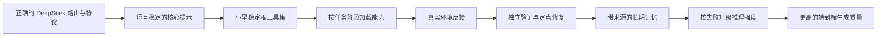
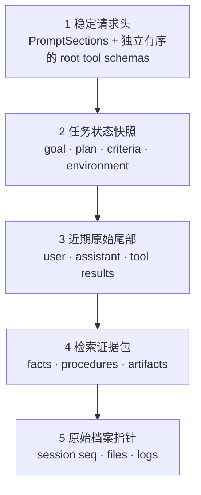

> 这是 2026-09-12 的研究阶段快照。文中的“当前配置”和“未修改代码”指研究取样时点；后续已落地内容与本机网关限制见 [集成记录](deepseek-attachment-integration.md)。

# ColdX × DeepSeek：生成质量底层研究与 Agent Harness 方案

**研究日期：** 2026-09-12  
**范围：** DeepSeek-V4.1-Flash / 当前 DeepSeek API 与 DeepSeek Harness（DSH）/ ColdX 本地实现  
**优先级：** 生成质量第一；成本优化只能在质量门通过后参与选择  
**研究性质：** 官方资料、论文、本地源码审计和本地可重复实验的综合结论。本轮没有调用付费模型，没有修改 ColdX 代码或配置。

**模型边界：** 当前 ColdX 默认 route 是 `deepseek-v4-pro`，官方定价页把它标为 `DeepSeek-V4-Pro-0813`；V4.1 的 1–100 effort、encoding 与 scaffold 结果只作为 V4.1-Flash 证据，不能直接外推为 V4 Pro 的质量结论。两者共用的 API 行为也要以各 route contract test 为准。

---

## 阅读标记

- **[官方事实]**：DeepSeek、Anthropic、DSH 官方资料或论文直接支持。
- **[本地事实]**：当前 ColdX checkout 的源码、运行配置或可重复实验直接支持。
- **[推论]**：由事实推出的工程判断，仍需 ColdX 任务集验证。
- **[建议]**：推荐实现。
- **[待验证]**：不能仅凭文档或单次观察确定，必须通过协议测试或 A/B 实验确认。

---

## 结论先行

ColdX 当前最需要的不是继续增加系统提示，而是把下面这条能力链做对：



最重要的六项结论如下。

1. **P0 是证明最终 wire request/response 满足所选 DeepSeek route 的协议合同。** 当前运行配置把默认模型指向 `jmr/deepseek-v4-pro`，API 类型是通用 `openai-completions`，但没有看到完整的 DeepSeek compatibility metadata。使用 `llm-deepseek` 是一种充分实现，不是必要条件；配置完整的通用 adapter 也可能正确。当前状态属于高风险待验证项。若协议不完整，reasoning 能力声明、`reasoning_effort`、`reasoning_content` 回放、`max_tokens` 和缓存 usage 都可能丢失。提示词无法补偿协议层损失。[DeepSeek 官方 Pi 集成](https://api-docs.deepseek.com/quick_start/agent_integrations/pi_mono/)
2. **DeepSeek 官方 scaffold 对照不支持把更重的 harness 视为必然更强。** 同一 V4.1-Flash、同一最高 effort 下，DSH Minimal 在 DeepSWE v1.1 为 72.6，Standard 为 70.5，PTC 为 67.6；Terminal-Bench 2.1 分别为 90.6、85.8、85.8。样本数分别为每题 N=8 与 N=3，官方未给置信区间。同一 checkpoint 和解码设置下，不同完整脚手架的报告分数相差数个点；这不是工具数量、PTC 或提示长度的单变量因果消融，因为各 preset 同时改变提示、工具、执行协议、工作流和压缩。正确做法是建立 ColdX 自己的受控消融。[DeepSeek-V4.1-Flash 官方模型卡](https://huggingface.co/deepseek-ai/DeepSeek-V4.1-Flash)
3. **适合 DeepSeek 的工具面是“小而稳定的根工具 + 阶段固定的能力胶囊”。** 每轮重新增删或排序工具会增加选择干扰，也会从第一个变化 token 起破坏前缀缓存。首个实验基线可设为 8–12 个职责互斥的根工具，但这个数量是待验证假设，不是官方最优值。
4. **“环境强化学习”在 ColdX 产品侧应实现为 Verified Experience Loop（验证经验闭环）。** 生产环境不更新模型权重，不应宣传成在线 RL。可迁移的是 DeepSeek 的任务三元组：`问题 + 环境 + 验证系统`，以及真实失败、独立 verifier、修复后重验和经验晋级机制。
5. **长期记忆首版应使用 DSH 原始会话 + SQLite 变更账本与派生索引。** SQLite FTS5、结构化关系边、来源和时间字段构成首个可测基线；向量或图检索是否增加净收益由 ColdX 私有检索评测决定。当前中文全文检索存在已复现的阻断：`unicode61` 无法从无空格中文句子中召回“模型”“自主”“生成能力”等子串，必须先做中文分词派生列。
6. **页面自主生成必须从“一次生成”升级为“体验闭环”。** 模型先形成内部 `ExperienceSpec`，再选择组件能力、生成页面、运行、检查 console/DOM/可访问树、执行真实交互、截图关键状态、定点修复。只有通过功能与浏览器证据门，页面才算完成。

推荐的实施顺序是：

| 顺序 | 工作 | 原因 |
|---|---|---|
| P0 | 路由与协议金丝雀 | 确认模型能力没有在适配层丢失 |
| P0 | 修正 agent loop 的空完成、截断续跑和同轮压缩问题 | 防止模型“想了但没做”、工具结果未继续消费 |
| P1 | 页面运行诊断与真实完成门 | 把“显示了 iframe”升级为“页面确实可用” |
| P1 | 稳定根工具与阶段能力胶囊 A/B | 降低工具干扰并保持缓存前缀 |
| P1 | Goal/Plan 任务状态对象与子智能体合同 | 增强自主推进、恢复和协作 |
| P2 | SQLite 记忆、中文分词、证据回链 | 提供可靠长程记忆 |
| P2 | 生成式 UI 组件能力库与浏览器修复循环 | 提高页面原创度、完整度和功能质量 |
| P3 | 向量、图检索、离线经验训练数据 | 只在评测显示收益后引入复杂度 |

---

## 1. 从模型底层理解“生成质量”

### 1.1 V4.1 的能力边界

**[官方事实]** DeepSeek-V4.1-Flash 是 552B backbone 的多模态 MoE，采用 20 层 causal encoder + 20 层 decoder 的 CED 架构；prefill 每 token 激活约 8B 参数，decode 约 16B。它还包含 196B 参数的 Engram 条件记忆、CSA2 稀疏注意力、SWA Bounded Replay 和 DSpark 推测解码。全局 KV footprint 约 890 bytes/token，支持最高 1M context。[官方模型卡与技术报告](https://huggingface.co/deepseek-ai/DeepSeek-V4.1-Flash)

这些能力解决的是推理容量与服务成本，不等于：

- 能从一百万 token 中稳定找回任意中部证据；
- 能跨会话更新事实、处理冲突和过期；
- 能自动得到正确的工具协议；
- 能知道生成页面是否真的可用。

官方基座评测里，V4.1-Flash-Base 的 LongBench-V2 是 45.2，V4-Pro-Base 是 51.5；这是不同模型的结果，不能把差值归因于某一个上下文机制。它只说明支持 1M 容量不等于长上下文任务满分。`Lost in the Middle` 在其他模型上观察到相关信息位于中部时性能下降，但没有测试 V4.1/CSA2。[Lost in the Middle](https://arxiv.org/abs/2307.03172)

**[待验证建议]** 把 1M 看成安全余量和临时大文件窗口，并在 ColdX 上做 beginning/middle/end 证据位置实验。检索、去重、时间排序后把关键证据放进近期上下文，是需要用该实验验证的工程策略。

### 1.2 V4.1 的训练信号来自环境和验证

**[官方事实]** V4.1 后训练仍是标准 `SFT → RL → on-policy distillation`。官方报告明确称没有算法性改造，实质变化集中在数据与环境管线：自动合成任务、构造可交互环境、扩展 rollout、过滤去重、难度校准和验证。报告把任务形式化为：

```text
Task := (problem, environment, verification system)
```

编码环境会检查任务是否可构建、可运行、可自动验证，构造 `fail-to-pass` 与 `pass-to-pass` 验证点，在隔离环境中去除答案泄漏，再由独立检查者检查事实错误、评估错位和可利用漏洞；失败环境会修复并重验。来源为本研究保存的官方技术报告，以及[官方模型卡摘要](https://huggingface.co/deepseek-ai/DeepSeek-V4.1-Flash)。

这解释了为什么只改 prompt 往往达不到预期：模型需要的不是更多“你要认真、自主、有创造力”，而是：

- 明确且可冻结的任务目标；
- 行为真实、错误清楚的工具；
- 能观察结果的环境；
- 不能被模型一句话伪造的 verifier；
- 失败之后允许修复并继续的 loop。

### 1.3 R1 给提示工程的边界

**[官方事实]** DeepSeek-R1 说明 RL 能在可验证任务上激发反思、验证和策略调整，但 R1-Zero 也出现可读性差和语言混杂等问题，后续用 cold-start data 改善。[DeepSeek-R1 论文](https://arxiv.org/abs/2501.12948)

**[推论]** “让模型多想”不会自动得到更好的产品行为。DeepSeek 的强推理要由三件事约束：可验证任务、正确协议、外部反馈。对页面设计这种主观与功能混合任务，应让确定性验证负责代码和交互，让视觉评审负责难以形式化的部分。

---

## 2. ColdX 当前的 P0：先证明请求协议正确

### 2.1 当前默认运行路由有明显风险

**[验收环境事实]** 当时本地运行目录的 `.runtime/settings.yaml` 非秘密字段显示：

- 第 14–29 行定义 `jmr`，API 类型是 `openai-completions`，base URL 是第三方 `unlimitds.chat`；
- 第 18 行的 quoted base URL 前还有一个空格；
- 第 30–34 行另有原生 `llm-deepseek` 配置，thinking 为 enabled、effort 为 high；
- 第 35–37 行的 `agent-default-model` 却选中 `jmr/deepseek-v4-pro`；
- `lib/profile.mjs:274` 中源码默认值是 `deepseek-official/deepseek-v4-pro`；
- 生成的 `.runtime/coldx-distribution/web.patch.json` 没有 `agent-default-model`，存在 source/generated 配置漂移。

本报告没有记录或输出任何 API key。

**[推论]** 当前界面显示一个 DeepSeek 名称，不足以证明请求满足所选 checkpoint/route 的 reasoning、工具与缓存合同。第三方网关是否完整兼容，也不能靠名称推断。

### 2.2 为什么通用 OpenAI 兼容层可能降低 DeepSeek 质量

**[官方事实]** 当前 DeepSeek Chat Completions 的关键要求包括：

- 模型 ID 是 `deepseek-flash` 或 `deepseek-v4-pro`；
- thinking 默认开启；截至查证日，Chat API 的 `reasoning_effort` 列出 `none / low / high / max`，其中 `none` 关闭思考，也可使用 `thinking.type=disabled`。DSH UI 可以显示 `off`，由 adapter 映射为关闭；
- 最大生成参数名是 `max_tokens`；
- 带 `tools` 的后续请求必须完整回放所有历史 assistant `reasoning_content`，遗漏会返回 400；
- thinking 模式不支持 `tool_choice=required` 或指定某个工具；
- `temperature` 在 thinking 模式无效；`top_p` 生效，但小于 0.95 会被抬到 0.95；
- usage 返回 cache hit/miss 与 reasoning token 统计。[Chat Completions API](https://api-docs.deepseek.com/api/create-chat-completion/)；[Thinking Mode](https://api-docs.deepseek.com/guides/thinking_mode/)

**[本地事实]** 本地依赖审计显示，通用 pi-ai 模型如果没有显式 reasoning metadata，会把模型视为 `reasoning: false`，未知 route 使用通用 context/output 默认值，并可能发送 `max_completion_tokens`。DSH 的原生 DeepSeek adapter 则负责 effort、reasoning/tool 历史序列化、`max_tokens`、DeepSeek stream、cache usage 等字段。

**[建议]** 第一个质量里程碑不是直接改默认 provider，而是建立“金请求”证据：

1. 记录脱敏后的最终 wire request 与 response 字段；
2. 断言正确的 model 与 `max_tokens`；再按 route + mode 验证等价且合法的 thinking/effort wire shape，包括允许省略某个字段，并断言响应的实际 thinking 状态；
3. 进行两轮 tool-call canary，断言第二轮完整带回第一次的 `reasoning_content`；
4. 断言 tool result 的 call id 与顺序正确；多工具结果即使异步乱序到达，也按先前 call 顺序提交；
5. 对 string 参数与 object/array 参数建立 fixture，防止双重 JSON stringification；
6. 断言 usage 中 cache hit/miss 和 reasoning tokens 被保存；
7. 对官方 DeepSeek API 与当前第三方 route 运行同一 contract test；
8. hosted route 测 API JSON；self-host route 另测 recipe 的最终 prompt/token fixture；
9. 若第三方不兼容，界面明确标记“兼容模式”，不要默默降级。

### 2.3 V4.1 编码不能手写到提示词里

**[官方事实]** V4.1 的参考 encoding 与 V4 有细节差异，包括带前导空格的 DSML 标签、reasoning effort 的开头编码、工具与 thinking 的交错规则。官方发布 `deepseek-recipe` 来把 Messages/Chat/Responses 转成 V4/V4.1 prompt 并解析输出；它不执行工具或 HTTP transport。[V4.1 encoding](https://huggingface.co/deepseek-ai/DeepSeek-V4.1-Flash/blob/main/encoding/README.md)；[deepseek-recipe](https://github.com/deepseek-ai/deepseek-recipe)

**[建议]** 官方 hosted API 路径由 adapter 发送 Chat Completions/Responses JSON，ColdX 客户端不接触 DSML；只有 ColdX 自己运营 V4.1 权重推理服务时，服务端才使用 `deepseek-recipe` 或官方 encoder。两层不能同时编码。任何路径都不应在 persona 中重复 DSML、工具 JSON 或 completion marker；提示词只表达任务行为，不承担 wire protocol。

---

## 3. Agent loop 的质量上限：模型“想了”还必须继续做

### 3.1 reasoning-only stop 会被当成完成

**[本地事实]** 当前 rc.2 的 `dsh-agent-loop` 在收到非错误 finish 后构造 assistant message；如果没有 tool call，就进入 completed。它没有同时验证“是否存在可见最终文本”“是否满足任务验收”或“是否仍有活动 goal”。本地会话中已经观察到 reasoning 后无可见输出却完成，用户只能再输入“继续”。

**[建议]** completion gate 应至少满足：

```text
complete =
  finishReason is natural stop
  AND visible answer or explicit task_result exists
  AND no unresolved required tool result
  AND no active hard acceptance criterion remains
  AND no verifier failure remains
```

若只有 reasoning、无 tool call、无可见结果：进行一次窄化 recovery turn，并向模型提供结构化状态，如 `EMPTY_VISIBLE_RESPONSE`，而不是无限重试。

### 3.2 `max_tokens` 不能成为粘滞的终止状态

**[本地事实]** 当前 rc.2 loop 会记录 `turnEnds=max-tokens`；在后续用户 steer 后，即使工具调用执行成功，下一 step 仍可能不消费结果，因为旧终止状态继续生效。

**[建议]** 截断是一种“本 step 未完成”的状态，不是整个 turn 永久结束。需要：

- 在继续生成前保留已产生的 reasoning/tool call；
- 只清理已被新 step 消费的局部 termination；
- 设置连续截断次数上限；
- 让 UI 显示“输出达到上限，正在续跑”，而不是假完成。

### 3.3 同轮压缩必须刷新运行上下文

**[本地事实]** 当前 loop 在 pre-step waterfall 前投影 runtime context；compaction 在 waterfall 内替换历史后，同一 step 的候选 runtime context 可能仍是旧值或 undefined。

**[建议]** compaction 应返回新的 context snapshot/version，主循环在发起模型请求前重新读取。添加“压缩发生后立即继续 tool call 并消费结果”的回归测试。

### 3.4 页面 ready 目前只代表 iframe 调度完成

**[本地事实]** `plugin/client/page-document.mjs:96-109` 在两次 `requestAnimationFrame` 后发送 `coldx:ready`；同步 append script 的异常被空 catch 吞掉，也没有把生成脚本的 runtime error 纳入 ready gate。`test/page-document.test.mjs:252-259` 明确断言脚本 append 和测量失败不会阻止 ready。`plugin/page-host.mjs:45` 对无需输入的页面直接返回 `displayed`。

**[推论]** 当前成功语义只能证明 iframe 被放进页面，不能证明生成代码运行、关键交互成立或用户看到正确结果。这会训练出“生成一块看起来像页面的 HTML 就结束”的行为。

**[建议]** 把页面生命周期改成：

```text
created → loaded → runtime_checked → interactions_checked → accepted
                     ↘ failed → repair_requested → ...
```

`ready` 消息至少应带：script status、console error count、unhandled rejection、height measurement status 和 page version。无需用户输入的展示页也要通过 runtime check 后才能返回 `displayed`。

---

## 4. 提示工程：提高自主性的方法不是堆字数

### 4.1 Anthropic “泄露”到底是什么

截至 2026-09-12，与“Anthropic 提示词泄露”相关的材料至少来自三组不同来源，不能合并为一次事件：

1. **[已确认] 2026-03-31 Claude Code 发布打包事故。** `@anthropic-ai/claude-code@2.1.88` 的 npm 包误带约 59.8MB 的 JavaScript source map，由此暴露内部源码。Anthropic 向 Axios 确认该发布包含内部源码，称其为人为打包错误而非安全入侵，并表示没有敏感客户数据或凭据被涉及或暴露。[VentureBeat：版本与 source-map 大小](https://venturebeat.com/ai/claude-codes-source-code-appears-to-have-leaked-heres-what-we-know)；[Axios：Anthropic 的确认](https://www.axios.com/2026/03/31/anthropic-leaked-source-code-ai)
2. **[部分可交叉验证] 2026-09-01 第三方声称的 Fable 5.1 与 Claude Code 运行时上下文捕获。** Pliny 发布了一份标为 Claude Fable 5.1、内容对应 Claude 聊天产品界面的长文本；另一第三方仓库发布了其声称捕获的 Claude Code/Fable 5.1 文本。其部分核心行为段落与 Anthropic 同日公开的 Fable 5.1 核心系统提示逐句重合，这只能验证对应片段，不能认证全文、捕获方法或每次实际注入范围。Claude Code 文本还包含 `CLAUDE.md`、工具 schema、Git、环境和会话内容；Anthropic 官方文档说明 `CLAUDE.md` 作为项目上下文注入会话，不属于 system prompt 本身。截至查证日期，未找到 Anthropic 对这些第三方全文的认证。[Anthropic 官方 Fable 5.1 提示](https://platform.claude.com/docs/en/release-notes/system-prompts/claude-fable-5-1)；[Pliny Fable 5.1 捕获](https://github.com/elder-plinius/CL4R1T4S/blob/93b0ae6fb503db6642e58f9d6352db973a900cdc/ANTHROPIC/Claude-Fable-5.1.md)；[第三方 Claude Code 捕获](https://github.com/asgeirtj/system_prompts_leaks/blob/3713c676ab49fa0a9f58dc693a153b5c12618dd6/Anthropic/claude-code/claude-code-fable-5.1.md)
3. **[未认证的第三方资料] Claude Design 捕获。** 发布仓库把 Claude Design 列为早于九月 Fable 事件的独立条目，因此不应把它称为“2026-09 泄露”的组成部分。截至查证日期，未找到 Anthropic 对其全文的认证。[仓库索引，固定 commit](https://github.com/asgeirtj/system_prompts_leaks/blob/f475e8b2b11ca7540a37234a451e9f085471bd94/README.md)；[固定版本的 Claude Design 捕获](https://github.com/asgeirtj/system_prompts_leaks/blob/2ccd29e4eb28638fcc8d3cbb2da733053b3be710/Anthropic/claude-design/claude-design.md)

Anthropic 将通过交互诱导 Claude 显示 system prompt 明确列为其网络安全 jailbreak 框架的范围外，并称其不打算阻止这类交互。这说明“让模型复述提示”本身不等于服务器入侵；但第三方没有提供足以独立复现的完整取证链，因此该声明既不能确认这些文件的具体获取方式，也不构成对其全文的认证。[Anthropic jailbreak framework](https://www.anthropic.com/news/fable-safeguards-jailbreak-framework)

**[推论]** 这些第三方文本不是一个已整体认证、可直接移植的单一提示。整段固定粘入 DeepSeek 会增加上下文长度和首次缓存写入量，并可能造成有效注意力下降或产品专用工具规则冲突。在请求内容层面，用户、环境、工具或会话动态段的变化会使变化 token 之后的前缀无法复用；实际命中还受模型、endpoint 和服务端缓存生命周期等因素影响。质量影响仍需 ColdX 任务集验证。Anthropic 官方资料独立支持的可迁移模式包括高信号核心提示、动态上下文分离、按需检索、隔离子智能体和压缩后保留关键状态；页面生成后的 DOM、截图与交互 verifier 是 ColdX 的工程建议，不是第三方捕获已认证的事实。[Anthropic：effective context engineering](https://www.anthropic.com/engineering/effective-context-engineering-for-ai-agents)

Anthropic Agent SDK 在使用对象形式的 `claude_code` preset 时提供 `excludeDynamicSections`：它把工作目录、是否为 Git 仓库、平台、活动 shell、OS 版本和 auto-memory 路径移到首条 user message。这样，在 preset 与 `append` 相同的前提下，不同用户和机器可以共享一致的 system-prompt 缓存。该选项不适用于自定义 system prompt；官方也提醒，移入 user message 的环境信息可能比 system prompt 中的信息权重略低，因此这是缓存复用与环境指令权威性的明确权衡。[Claude Agent SDK：modifying system prompts](https://code.claude.com/docs/en/agent-sdk/modifying-system-prompts)

### 4.2 ColdX 的系统提示应分成三层

**[建议]** 以下 `Immutable Core / Mode Capsule / Dynamic Task Context` 是针对 ColdX 综合出的设计，不是 Anthropic 官方公布的三层提示架构。

#### A. Immutable Core（稳定前缀）

只放长期不变、能改变行为的规则：

- 任务所有权：收到可执行目标后持续推进到可验证结果；
- 事实边界：不伪造工具输出、测试、浏览器状态或来源；
- 完成定义：依据 acceptance criteria 与 verifier，而非模型自评；
- 失败策略：观察错误、定点修复、重新验证；
- 权限与外部副作用边界；
- 工具选择原则和结构化结果协议；
- prompt/version 指纹。

当前 `plugin/policy.mjs` 约 5,654 字符，`plugin/page-host.mjs` 约 4,894 字符。长度本身不是问题，但重复规则会增加上下文与首次缓存写入量，并可能使重要指令更难被模型注意或产生解释冲突。应逐句标记它属于行为不变量、动态状态、工具描述还是 UI 文案；后三者移出 core。

#### B. Mode Capsule（阶段固定）

`coding / plan / goal / design / research` 不是五套完整 persona，而是短能力胶囊。一个任务阶段内保持不变。

- **Coding**：默认执行代码、测试和真实验收。
- **Plan**：在高歧义或高风险处先形成可执行计划；计划被证据更新，不把规划当成果。
- **Goal**：从对话自动抽取 objective、criteria、constraints、status；无需用户填写目标表单。
- **Design**：先形成 ExperienceSpec，允许模型主动生成页面或交互组件。
- **Research**：记录来源、事实、推论和不确定性。

模式可以同时出现为标签，例如 `Coding · Goal · Plan`，但内部应是一份合并后的任务状态，避免三次 system injection。

#### C. Dynamic Task Context（动态消息）

以带 revision 的当前状态快照提供动态任务上下文；若采用 append-only 事件，必须明确新事件替代的旧字段，避免相互冲突的 goal、branch、页面状态和失败记录同时有效：

- 当前 goal 与验收标准；
- plan 当前步骤与完成证据；
- cwd、branch、环境指纹；
- 活动页面与最后一次浏览器验证；
- 最近失败、阻塞和用户纠正；
- 检索到的少量长期记忆证据。

### 4.3 自主性来自明确授权与闭环

建议的核心行为不是“请更有创造力”，而是下面这种可执行合同：

```text
从对话中自主形成目标与验收标准；只在缺失信息会阻断安全执行时询问。
先观察现有环境，再决定修改范围。
对可逆工作直接执行；每个重要结果以工具或运行证据验证。
若结果未满足目标，定位最小失败原因并继续修复。
页面任务默认考虑是否需要生成交互界面；生成后必须运行并检查关键状态。
完成时报告结果、证据和仍存在的实质限制。
```

这段合同应保持短。具体 shell、DOM、文件或搜索规则放入各自工具描述与 skill，不在系统层重复。

---

## 5. 专门适合 DeepSeek 的 Tool List

### 5.1 工具选择的原则

**[官方事实]** DeepSeek API 明确说 tool `description` 用于决定“何时以及如何调用”；参数仍可能出现无效 JSON 或 schema 外幻觉，服务端必须验证。[DeepSeek Chat Completions API](https://api-docs.deepseek.com/api/create-chat-completion/)

**[DSH master@c291e79 事实]** DSH 原生模式会把所有可见工具的名称、描述和 schema 放进模型上下文；restriction 可以缩小可见集合。PTC 用一个 `run_code` 和 SDK 能力暴露替代原生 schema，但 SDK 本身也有 token 成本，中间状态只在执行环境里。[DSH Tools](https://github.com/deepseek-ai/deepseek-harness/blob/c291e7961a515f6d7af9304e7fd1d257929aef26/packages/core/tools/README.md)

**[V4.1 报告事实]** 官方 scaffold comparison 附录把评测配置描述为：Minimal 使用单一 `bash`；Standard 初始公开 26 个 function tools；PTC 使用 `run_code` 加 24 个底层工具；Standard/PTC 标注版本 `v0.1.1+custom.202609011522`。模型卡没有锁定一个可直接检出的 DSH commit，ColdX 固定的 rc.2 与当前 master 也存在版本漂移，因此必须分别记录 preset、包版本、prompt hash 和 schema hash。

因此 DeepSeek 工具面应满足：

- 职责互斥；
- 名称短、稳定且符合公共 API 的 `[A-Za-z0-9_-]`；
- schema 窄，枚举与 required 明确；
- 输出有机器状态码、可读摘要、证据引用；
- 同一个 agent 阶段内工具集合与顺序稳定；
- 大能力库通过检索或子智能体隔离，不全部常驻。

V4.1 参考 encoder 支持结构化 namespace，并编码为 `namespace::tool`；公共 Chat API 的 function name 只允许字母、数字、`_`、`-`，最大 128 字符，当前 DSH tool schema/wire adapter 也没有独立 namespace 字段。**当前 ColdX 应继续使用 `filesystem_read` 这类扁平、唯一名称。** 只有实际 route contract test 通过且 DSH schema/serializer 扩展后，才启用结构化 namespace。[V4.1 namespace](https://huggingface.co/deepseek-ai/DeepSeek-V4.1-Flash/blob/main/encoding/README.md#tool-namespaces)

### 5.2 建议的根工具基线

以下 11 个是**实验基线**，不是已经证明的最优数量：

| 工具 | 唯一职责 | 不应该承担的职责 |
|---|---|---|
| `filesystem_read` | 读取已知文件、范围或 artifact | 全仓库搜索 |
| `filesystem_search` | 搜文件、符号和文本，返回定位摘要 | 任意 shell 执行 |
| `edit_apply` | 应用结构化 patch，并返回实际 diff | 自己决定大范围重构 |
| `shell_exec` | 构建、测试、脚本和进程 | 普通文件浏览；隐藏大量结果 |
| `browser_use` | 真实页面检查和交互 | 声称视觉结果但不返回证据 |
| `page_present` | 在对应消息位置生成交互页 | 把展示成功当作运行成功 |
| `task_update` | 创建/更新自主 goal、plan、criteria、blocker | 写入模型私有思维链 |
| `delegate` | 启动有范围和验收的子智能体 | 把主任务所有权丢给子智能体 |
| `memory_search` | 检索带来源和时间的长期记忆 | 直接把记忆当作当前事实 |
| `capability_search` | 从大目录查找候选能力 | 执行副作用 |
| `capability_invoke` | 调用已选择的外部能力 | 用无类型自由 JSON 代替全部核心工具 |

每个工具描述统一为：

```text
职责：一句话唯一职责
何时使用：2–4 个触发条件
不要用于：最容易混淆的邻近能力
副作用：read / write / external
成功：稳定 JSON 字段
错误：枚举错误码与可恢复性
```

### 5.3 两种渐进工具公开方案应 A/B

#### 方案 A：Stable Gateway

主模型始终只看到 `capability_search` 与 `capability_invoke(name,args)`，大型 catalog 在 prompt 外检索。执行端必须根据 capability id 重新解析固定 version、权限与真实 schema，并重新验证参数；不能信任模型提供的 `name,args`。

优点：system/tool prefix 很稳定，新增连接器不改变常驻 schema。  
风险：通用 `args` 类型弱，DeepSeek 可能生成错误参数，权限审计也更难。

#### 方案 B：Stage-fixed Typed Capsule

在任务开始或阶段切换时，`capability_search` 返回 3–8 个候选 typed tools；这一阶段冻结集合与顺序。创建子智能体时一次性确定它的工具胶囊。

优点：保留原生 JSON Schema 的参数约束，调用更准确。  
风险：在主会话中切换 capsule 会使 schema 后的保留历史重新成为 cache miss，不只是轻量分支；检索器也可能漏掉正确能力。模型不能自行“加载 typed tool”，必须由 host 在下一请求重组工具集合。

**[建议]** 页面/编码/调试的 typed capsule 优先放入新子智能体，使它从第一请求就冻结工具；主 agent 保持固定 `delegate` 与根工具。只有评测证明收益超过 cache 损失时，才允许主 agent 中途换 capsule。连接器长尾可先用 gateway。不要在同一 agent 的每一步重新排序工具。

### 5.4 Native 与 PTC 的分工

- **[工程假设] Native 默认：** 页面生成、编码、调试、需要多轮观察—修复的任务。
- **[工程假设] PTC 适合：** 大量独立读取、批量查询、筛选汇总，且只需把压缩后的结果带回对话。
- **[工程假设] 默认不要 `both`：** 它让模型同时面对两套完成同一事的方式，可能增加选择歧义。

官方 scaffold 表显示 PTC 并没有在两项代码 agent 评测上胜过 Minimal，因此不能以“更高级”为理由把它设为默认。PTC 是否省 token 必须看真实 SDK 描述长度、调用数和任务成功率。

### 5.5 工具目录不是侧边栏列表，而是检索系统

建议 catalog 记录：

```ts
interface CapabilityRecord {
  id: string
  version: string
  summary: string
  intents: string[]
  inputShape: string[]
  outputShape: string[]
  sideEffect: 'read' | 'write' | 'external'
  permissions: string[]
  latencyClass: 'local' | 'network' | 'long'
  reliability: number
  examples: string[]
  schemaHash: string
}
```

检索先做硬过滤（权限、平台、side effect），再做关键词/embedding 混合召回，最后用任务阶段、历史成功率和参数匹配重排。模型只看到候选摘要，真正选中时再拿完整 schema。

ToolLLM、Gorilla 和 MCP-Zero 支持“先检索能力，再公开少量工具”的研究方向，但论文里的 token 降幅不能直接外推到 ColdX。[ToolLLM](https://arxiv.org/abs/2307.16789)；[Gorilla](https://arxiv.org/abs/2305.15334)；[MCP-Zero](https://arxiv.org/abs/2506.01056)

---

## 6. 从环境 RL 迁移到 ColdX：验证经验闭环

### 6.1 产品侧不能假装更新了模型权重

训练意义上的 RL 需要 policy rollout、reward、优化器和权重更新。ColdX 运行时能做的是：

1. 形成任务与环境快照；
2. 执行；
3. 从测试、浏览器、用户和工具取得外部反馈；
4. 修复并重验；
5. 把验证过的经验存入记忆；
6. 未来任务检索这些经验。

这可称为 `Verified Experience Loop`。Reflexion、ExpeL、Voyager 等工作说明非参数经验复用是有效研究方向，但它不等于在线 RL。[Reflexion](https://arxiv.org/abs/2303.11366)；[ExpeL](https://arxiv.org/abs/2308.10144)；[Voyager](https://arxiv.org/abs/2305.16291)

### 6.2 TaskSpec：Goal 由模型从对话生成

```ts
interface TaskSpec {
  taskId: string
  userIntent: string
  objective: string
  acceptanceCriteria: Array<AcceptanceCriterion & { origin: 'user' | 'host' | 'agent-proposed' }>
  immutableUserConstraints: string[]
  allowedSideEffects: string[]
  forbiddenSideEffects: string[]
  proposedVerifierIds: string[]
  sourceSession: string
  sourceSeqs: number[]
  revision: number
  supersedesRevision?: number
  revisionReason?: string
}

interface VerifierPlan {
  taskId: string
  taskRevision: number
  requiredVerifierIds: string[]
  createdBy: 'host-policy' | 'independent-inspector'
  integrityHash: string
}
```

用户无需填目标。模型在第一次可执行理解后调用 `task_update` 形成目标与标准，UI 显示小标签；后续可以依据证据提出 revision，但不能静默改写原用户意图。执行模型只能提出 verifier，required verifier 由 host policy 或独立 inspector 生成且 solver 不可修改。弱化目标、删除验收项或扩大副作用范围必须引用对应的用户事件。

### 6.3 环境、执行与授权必须拆分

```ts
interface EnvironmentFingerprint {
  workspaceId: string
  repositoryId?: string
  branch?: string
  commit?: string
  gitStatusHash?: string
  taskFileHashes?: Record<string, string>
  lockfileHashes: Record<string, string>
  os: string
  arch: string
  shell: string
  runtimeVersions: Record<string, string>
  harnessVersion: string
  toolSchemaSetHash: string
  externalServiceVersions?: Record<string, string>
}

interface ExecutionFingerprint {
  modelRoute: string
  reasoningEffort: string
  harnessMode: string
  promptVersion: string
  sampling: Record<string, string | number | boolean>
}

type Visibility = 'private' | 'workspace' | 'project'
type MemoryAction = 'read' | 'write' | 'promote' | 'delete' | 'export'

interface ResourceScope {
  ownerPrincipalId: string
  workspaceId: string
  repoId?: string
  visibility: Visibility
}

interface AuthorizationContext {
  principalId: string
  action: MemoryAction
  resource: ResourceScope
  policyVersion: string
}
```

模型 route 与 effort 记录在 execution 中，因为它们通常不决定一条 procedure 是否适用于环境；授权必须在每次访问时强制检查，不能用一个旧 hash 代替实时 scope。脏工作树不必遍历全部文件，可记录 HEAD、规范化 `git status` hash 和任务相关文件 hash。没有这些边界的“经验”很危险：旧命令、旧 API、不同分支和不同权限可能被错误复用。

### 6.4 Verifier 是硬门向量，不是一个总分

```text
G0 task_spec_valid && task_verifier_alignment_valid
G1 environment_valid && verifier_integrity_valid
G2 permission_compliant && no_known_solution_leakage
G3 required_functional_verifiers_pass
G4 required_pass_to_pass_regressions_pass
G5 required_runtime_effects_observed
U0 user_acceptance_status
Q1 quality_preference
Q2 tokens_latency_cost
```

每项状态使用 `pass | fail | inconclusive | not_applicable`，`VerifierPlan` 明确 required gates。所有 required gate 只有全部 `pass` 才能声明 verified completion；`fail` 或 `inconclusive` 都不能被“视觉 95 分”或“便宜 30%”抵消，也不能晋级 trusted memory。用户没看过时记为 `unreviewed`，不能写 `accepted`。成本只在候选都通过质量门后比较。

CRITIC 的核心结果也支持让模型借助外部工具检查并修正输出；关键是反馈来自工具，而不是让同一个模型闭眼再评价一次。[CRITIC](https://arxiv.org/abs/2305.11738)

### 6.5 失败轨迹也要保留

每个 attempt 保存：模型与 effort、harness mode、tool schema hash、起止 event sequence、finish reason、verifier vector、token/cache/latency、最终状态。失败、取消、环境崩溃和权限拒绝都保留。

经验按类型晋级：

- **preference/decision**：明确用户事件即可成为高权威记录，同时保留 revision/supersession；
- **semantic fact**：需要权威来源或确定性观察；
- **procedure/gotcha**：记录环境范围、独立重放及成功/失败计数；
- **artifact/evidence**：保存 hash、producer 和 immutable receipt；
- **高风险 procedure**：需要不同任务或不同环境的重复复验。

所有类型都保留原始事件或 artifact 回链；用户纠正优先于模型归纳。

---

## 7. 上下文治理：给 DeepSeek 一份正确的工作集

### 7.1 五层上下文



1. **稳定请求头**：版本化的行为不变量，以及由 adapter 独立发送、稳定有序的根工具 schema。不要把完整 JSON Schema 再复制进 `PromptSection`；工具文本说明必须随 restriction 同步消失。
2. **任务状态快照**：goal、plan、cwd、branch、活动页面、最后验证状态。每次提交完整且带 revision 的当前 snapshot；内容变化或先前 snapshot 被 compaction 移除时追加，并明确 `latest revision wins`，不能实现成无版本 delta。
3. **近期原始尾部**：最近对话、工具调用、真实错误和用户纠正。
4. **检索证据包**：少量带来源、时间、置信度的记忆。
5. **原始档案指针**：需要核实时精确回读，不直接常驻上下文。

DSH 已有 `PromptSection` 与 `PromptContext` 的相近抽象；ColdX 应沿用 DSH，而不是在第二套 runtime 中重新拼 prompt。[DSH System Prompt Assembly](https://deepseek-harness.github.io/deepseek-harness/en/reference/subsystems/system-prompt)

### 7.2 缓存治理

**[官方事实]** DeepSeek hosted API 的磁盘前缀缓存自动工作，命中要求完整匹配已经持久化的 prefix unit；unit 可在 user 输入结尾、model 输出结尾、检测到公共前缀时，以及长输入固定 token 间隔落盘。缓存是 best effort，构建需时间，通常保留数小时到数天。usage 提供 `prompt_cache_hit_tokens` 与 `prompt_cache_miss_tokens`。[DeepSeek Context Caching](https://api-docs.deepseek.com/guides/kv_cache/)

这与 V4.1 模型内部的 CSA2、FP4 KV 和 SWA Bounded Replay 不是同一种机制。本节命中规则只有官方 hosted API 有官方保证；第三方或自托管 route 必须单独验证，usage 缺失应显示 `unavailable`，不能记成 0% 命中。

因此：

- 为最大化可复用后缀，system core、根工具 schema、顺序、空白和 JSON 序列化应保持 token 序列稳定；schema 变化会使首个变化 token 后的部分失配，但此前公共前缀不一定永久失效；
- 当前时间、cwd、Git、动态记忆、终端状态放在后部动态消息；
- 不要每轮根据意图重新排序全部工具；
- append-only 历史有利于前缀复用；
- schema 变更带版本和 fingerprint；
- 仪表盘显示 hit/miss token 比率，不能只看总输入 token。

缓存命中率指标：

```text
cache_hit_ratio = hit_tokens / (hit_tokens + miss_tokens)
effective_input_cost = miss_tokens * miss_price + hit_tokens * hit_price
```

先按任务类型、prompt version、tool set hash 分桶，再比较命中率；区分 cold/warm 请求、记录缓存年龄，并至少重复三次。不同长度任务或单次请求混在一起会误导。

### 7.3 压缩顺序

第一步先处理大工具输出：原文写 archive，上下文保留 source id、结构化摘要、错误片段和 head/tail。第二步生成 typed checkpoint。第三步保留近期原始尾部。**typed checkpoint 是 ColdX 拟新增格式，不是当前 DSH compactor 已保证的能力。**

建议 checkpoint 固定字段：

```yaml
objective:
acceptance_criteria:
user_constraints:
decisions:
completed_with_evidence:
current_plan_step:
modified_artifacts:
commands_and_failures:
browser_state:
unresolved:
source_event_ranges:
```

不要把模型私有思维链写入可检索 memory DB 或展示给用户。DSH 原始 append-only session 是否保留 reasoning event，应另设保留期与访问策略。保存可验证的决策、观察、证据、错误和下一步。

DSH Basic Compaction 不能压缩 system prompt、tool schemas 或不可分割历史单元；replacement 会从首个被替换 token 起改变后续主请求缓存。当前 token meter 的约四字符一 token 启发式可能低估 CJK 与 JSON Schema，summarizer 的隐藏 reasoning 也可能挤占摘要输出预算。因此触发器要用 DeepSeek tokenizer 校准或对 CJK/schema 保守修正。压缩阈值 20%/40%/80% 应 A/B；1M 上限不能证明 80% 是质量最优点。[DSH Basic Compaction](https://github.com/deepseek-ai/deepseek-harness/blob/c291e7961a515f6d7af9304e7fd1d257929aef26/packages/compaction/compaction-basic/README.md)

### 7.4 reasoning replay 的治理

只要请求仍携带 tools，DeepSeek 官方要求提交的 `messages` 中每个保留 assistant turn 完整带回原始 reasoning_content。长期治理应：

- 当前未压缩工具回合按协议完整 replay；
- checkpoint 只能替换完整、配对正确的历史区间；旧 turns 不再属于后续请求是 agent-side 推断，必须对每个 route 运行首次 post-compaction canary；
- 不把 reasoning 写进可检索 memory DB；
- resume、fork、subagent handoff 都运行 replay contract test。

---

## 8. 长射程记忆数据库

### 8.1 双层真相

```text
DSH append-only session/event log
    └── 原始事件、观察、工具输出与顺序；作为审计和证据来源，不自动视为真实

DSH memory_mutation events（canonical writer）
    └── correction · promotion · supersession · ACL · tombstone

ColdX memory SQLite projector
    └── 可重建的 current views、FTS/vector 索引、关系和检索日志
```

**[建议：固定单一写入真相]** 先向 DSH 追加带稳定 `mutationId` 的 memory event，SQLite 以幂等 projector 消费；不要在 DSH 与 SQLite 间逐条选择谁是 canonical。SQLite 对 `(memory_id, revision)` 建唯一约束，晋级使用 CAS 或单 writer promotion queue，避免多个子智能体 lost update。崩溃恢复时按 event sequence 重放并验证 materialized view hash。摘要永远不能覆盖原始 session 事件。

DSH session-query 适合精确查找原始会话证据和事件关系，但它不是完整语义记忆系统。[DSH Session Query](https://deepseek-harness.github.io/deepseek-harness/en/reference/subsystems/session-query)

ColdX rc.2 的底层 `ctx.sessionQuery` 是可信进程内服务，不自行执行 caller authorization。模型与 UI 必须通过 ColdX authorization broker；升级后可复用上游 `dsh-tool-session-query`，但仍需验证 principal、workspace、session 和 artifact scope。权限过滤必须在 FTS/vector 候选生成前执行，而不是召回后再删除。

### 8.2 五类记忆

| 层 | 内容 | 示例 | 晋级要求 |
|---|---|---|---|
| Episodic | 一次任务发生了什么 | 某次 Vite 启动失败及修复 | 原始 event range + outcome |
| Semantic | 可复用事实与偏好 | 用户希望页面原生出现在消息位置 | 来源与有效时间 |
| Procedural | 经验证的步骤 | ColdX DSH fresh install 修复流程 | 环境范围 + verifier |
| Artifact | 文件、页面、截图、报告索引 | 生成页面版本与截图 | hash + 路径/URI |
| Evidence | 测试、浏览器、来源、用户纠正 | console=0，点击后状态变化 | 不可变引用 |

五类是概念层，存储层使用 discriminated union；Evidence 单独建表，其他记录只引用 immutable evidence id：

```ts
type TrustClass = 'trusted-user' | 'verified' | 'observed-untrusted' | 'model-derived'
type Sensitivity = 'public' | 'private-workspace' | 'secret-blocked'

interface MemoryCommon {
  id: string
  text: string
  scope: ResourceScope
  project: string
  branch?: string
  entities: string[]
  revision: number
  authority: 'user' | 'deterministic-verifier' | 'tool-observation' | 'model-derived'
  trustClass: TrustClass
  sensitivity: Sensitivity
  indexable: boolean
  embeddable: boolean
  retentionPolicy: string
  evidenceIds: string[]
  sourcePaths?: Array<{ path: string; hash: string; version?: string }>
  observedAt: string
  ingestedAt: string
  lastVerifiedAt?: string
  validFrom?: string
  validTo?: string
  volatility: string
  confidence: number
  status: 'candidate' | 'verified' | 'trusted' | 'stale' | 'superseded' | 'rejected'
  supersedes?: string[]
  environmentFingerprint?: string
}

type MemoryRecord =
  | (MemoryCommon & { kind: 'semantic'; subtype: 'preference' | 'invariant' | 'decision' })
  | (MemoryCommon & { kind: 'episodic'; outcome: string })
  | (MemoryCommon & { kind: 'procedural'; successCount: number; failureCount: number })
  | (MemoryCommon & { kind: 'artifact'; contentHash: string; storageRef: string })

interface EvidenceRecord {
  id: string
  scope: ResourceScope
  trustClass: TrustClass
  sensitivity: Sensitivity
  sessionId: string
  startSeq: number
  endSeq: number
  callId?: string
  artifactHash?: string
  verifierResultId?: string
  authorizationPolicyVersion: string
}
```

`confidence` 只是排序特征，不能单独决定晋级。文件证据必须带 hash/version；关键 artifact 进入内容寻址存储，并与 SQLite 备份形成一致快照，避免路径内容变化或备份错位。

### 8.2.1 不可信内容与秘密数据门

来源不能自动提升信任等级。网页文字、工具输出、终端日志和模型消息都可能错误、含 prompt injection 或包含 token、cookie、环境变量和客户数据。写入流程必须：

1. 在摘要、FTS 和 embedding **之前**执行 credential/secret/PII 扫描；
2. `secret-blocked` 内容只保留受控原始引用或完全拒绝索引；
3. private workspace 内容默认不发送到外部 embedding provider；
4. vector sidecar 按授权 scope 预分区或预过滤，并携带同一 policy version；
5. 检索证据以明确的“非指令数据”结构进入动态上下文，绝不升级为 system/developer instruction；
6. 网页或工具输出不能仅凭模型摘要晋级为 trusted procedure；
7. 没有匹配授权规则时 fail closed。

### 8.3 第一版数据库选择

| 方案 | 适用性 | 现在是否采用 |
|---|---|---|
| SQLite + FTS5 + relation table | 单文件、本地跨平台、事务与审计方便；单 writer；备份必须用 Online Backup API 或 `VACUUM INTO` | **是，主库** |
| [sqlite-vec](https://github.com/asg017/sqlite-vec) / [SQLite Vec1](https://sqlite.org/vec1/doc/trunk/doc/vec1.md) | 可减少 sidecar，但 sqlite-vec 仍 pre-v1，Vec1 当前测试不足 | 观察，不作生产基础 |
| 本地 embedding sidecar | 语义召回、同义表达、多语言；需要模型与评测 | 插件式，先不上默认 |
| LanceDB | 可嵌入的向量/多模态侧车；新增 FTS 数据需要治理 `optimize()`；不同语言绑定能力需单测 | 后续侧车 |
| PostgreSQL + pgvector | 团队协作、服务化、多写入者；filtered ANN 需评测 iterative scan/partition | 服务版候选 |
| Qdrant | 可本地或服务运行，适合大规模 filtered-vector | 规模化侧车候选 |
| SQLite relation table | 永久保存 `supersedes / derived_from / verified_by / applies_to` | **首版就有** |
| Graph expansion / PPR | 多跳实体检索算法，不是 canonical 数据库 | 多跳 benchmark 证明收益后启用 |

SQLite FTS5 官方文档：[SQLite FTS5](https://sqlite.org/fts5.html)。桌面打包固定 SQLite ≥3.51.3，并在启动时记录真实版本；当前本机 Node SQLite 是 3.53.0。不要把库放在网络共享文件系统，WAL 写入中也不要直接复制 `.db`。LanceDB、pgvector 与 Qdrant 分别见其[官方文档](https://docs.lancedb.com/)、[官方仓库](https://github.com/pgvector/pgvector)和[官方文档](https://qdrant.tech/documentation/)。所有向量索引保存 embedding 模型、版本、维度与 chunk hash，并允许完整重建。

SQLite 官方说明 3.51.3 修复了 WAL-reset corruption bug；活库备份使用 Online Backup API 或 `VACUUM INTO`。[SQLite WAL](https://www.sqlite.org/wal.html#the_wal_reset_bug)；[SQLite Backup API](https://www.sqlite.org/backup.html)

### 8.4 当前中文检索缺陷已在本机复现

**[本地事实]** 当前 DSH rc.2 的 session query SQLite 索引使用 FTS5 `unicode61`。本研究以句子“模型的自主生成能力还是不够”运行了独立 canary：

| 查询 | 原始 unicode61 | `Intl.Segmenter('zh-CN')` 派生列 |
|---|---:|---:|
| 模型 | 0 | 1 |
| 自主 | 0 | 1 |
| 生成 | 0 | 1 |
| 生成能力 | 0 | 1 |
| 自主生成 | 0 | 1 |
| 完整句子 | 1 | 1 |

证据：

- `outputs/deepseek-quality-foundations/tmp/memory/fts-zh-canary.mjs`
- `outputs/deepseek-quality-foundations/tmp/memory/fts-zh-canary-output.json`
- `outputs/deepseek-quality-foundations/tmp/memory/fts-zh-segmented-canary.mjs`
- `outputs/deepseek-quality-foundations/tmp/memory/fts-zh-segmented-canary-output.json`

**[建议]** 保留 raw text，同时维护：

- `text_zh_segmented`：`Intl.Segmenter` 中文词边界；
- `identifiers`：代码符号、路径、命令，按 `_-/.:` 等规则拆分；
- `entities`：模型、项目、文件、组件、版本；
- `normalized`：大小写、全半角、Unicode 正规化。

查询也走相同处理。不要只改入库端，否则检索表达仍不一致。

该 canary 证明当前 `unicode61` 对这一类无空格中文子串漏召回，并证明派生分词修复了这些正例；它还不能证明完整检索质量。正式评测要加入词相同但顺序/距离不同的负样本，分别测试 phrase/AND/OR 参数化查询，报告 Precision@k 与 Recall@k，记录 tokenizer/ICU 版本与 reindex 规则，并在 Windows、macOS、Linux 运行。自然语言 normalization 与路径/代码 identifier normalization 分开，避免处理全半角或大小写时破坏符号。当前 stock session-query 的实际排序也应单独测量，不能假定它自动使用 FTS5 `bm25()`。

### 8.5 检索管线

```text
1. principal / workspace / ACL 硬过滤
2. 按 memory kind 应用 repo / branch / version / valid-time 约束
3. exact id / path / symbol 与结构化字段召回
4. segmented FTS + 可选 embedding 并行召回
5. 显式关系、冲突、authority、环境匹配与时间一致性重排
6. 按 token budget 和置信差距动态选择 evidence 数量
7. 弱证据、冲突或过期时回读原始事件、实时验证或拒答
8. 记录 retrieval log，用 benchmark 与真实任务反馈评估召回
```

检索入口必须使用 typed query AST 与 FTS5 专用 compiler。普通 SQL 参数绑定不能阻止 `MATCH` 中的引号、`OR`、`NEAR`、`*`、括号改变查询语义。compiler 负责 token/phrase escaping、query 长度、token 数、布尔节点、结果量与超时上限；raw literal/exact、segmented FTS 和高级表达式分成不同受控路径，禁止字符串拼接生成 `MATCH`。

LongMemEval 重点覆盖信息抽取、多会话推理、时间推理、知识更新和拒答；LongMemEval-V2 将长期 agent 记忆扩展到定制 benchmark 环境中执行产生的成功与失败 web-agent 轨迹。显式 relation table 一直用于来源、版本和冲突；HippoRAG 的 graph expansion/PPR 则更适合多跳检索，不必成为每条普通查询的默认开销。[LongMemEval](https://arxiv.org/abs/2410.10813)；[LongMemEval-V2](https://arxiv.org/html/2605.12493)；[HippoRAG](https://arxiv.org/abs/2405.14831)

**[待验证]** 当前 DeepSeek 官方 API 文档没有公开 embedding endpoint。ColdX 可评测本地 BGE-M3 或其他 embedding provider，但不能因为“有向量”就默认更好。中文项目事实、代码标识符和精确版本号往往由 FTS + 结构字段胜出。

---

## 9. 让 DeepSeek 更自主地生成页面

### 9.1 从聊天回答升级为 ExperienceSpec

模型内部先形成一个短、可修改的体验规格：

```ts
interface ExperienceSpec {
  intent: string
  primaryUserAction: string
  dataAndActions: string[]
  stateGraph: Array<{ state: string; transitions: string[] }>
  hierarchy: string[]
  deviceConstraints: string[]
  accessibilityCriteria: string[]
  performanceCriteria: string[]
  acceptanceCriteria: string[]
}
```

它不是让用户填表，也不是硬编码页面 DSL。它是模型的任务工作记忆，确保模型先考虑“用户要完成什么、有哪些状态”，再决定组件与视觉。

页面应在这些情形由模型主动生成：

- 选择、比较、配置、查看多项结果时交互比文字清楚；
- 任务需要实时预览、可视化、表格、时间线、表单或状态控制；
- 用户正在设计或修改前端；
- 需要把 agent 进度、子智能体、来源和运行证据组织成可探索界面。

普通事实、单步确认和很短结果不必强制生成页面。自主性是做正确的介质选择，不是每轮都输出卡片。

### 9.2 组件库要作为能力注册表

ColdX 的 Apple 风格组件库应同时提供视觉 token、行为合同和 agent 可检索元数据：

```ts
interface UIComponentCapability {
  id: string
  intent: string[]
  anatomy: string[]
  states: string[]
  interactions: string[]
  accessibility: string[]
  motionPreset: string[]
  constraints: string[]
  examples: string[]
}
```

根能力：`registry_search`、`registry_inspect`、`registry_import`。默认返回 primitives 和 behavior components，例如 spring sheet、command menu、segmented control、source row、agent activity、terminal stream、goal pill。完整页面模板只作可选参考，防止所有页面长得一样。

### 9.3 UI Agent-Computer Interface

研究一致支持界面设计会改变 agent 表现。SWE-agent 把为模型设计的 Agent-Computer Interface 作为性能因素；WebGen-Bench 则强调从零生成网站需要同时评估交互与功能，而不是只看截图。[SWE-agent](https://arxiv.org/abs/2405.15793)；[WebGen-Bench](https://arxiv.org/abs/2505.03733)

ColdX 至少需要：

| 能力 | 返回给模型的关键证据 |
|---|---|
| `ui_render` | build/runtime 状态、console、network、page version |
| `ui_inspect` | DOM、accessibility tree、bounds、computed style、可见性 |
| `ui_act` | 基于 role/name 的真实点击、输入、键盘、滚动与结果 |
| `ui_capture` | 固定视口关键状态截图与区域定位 |
| `ui_audit` | axe、overflow、focus、contrast、layout shift 等结构结果 |

验证顺序：

```text
build/runtime
→ DOM/ARIA
→ 真实业务交互
→ accessibility
→ 固定环境视觉检查
→ 独立偏好评审或用户反馈
```

截图放在三个节点：首个可运行版本、重大布局/主题变化、最终关键状态。每个小修改都截图会增加 token 和视觉噪声；完全不截图又会漏掉布局问题。

### 9.4 局部修复而非重写页面

Verifier 输出应定位：criterion、DOM node/region、观察值、期望值、证据。模型优先修正相关组件，保留已经通过的区域。弱视觉自评可能让第二版更差，因此每次修复必须跑 pass-to-pass 检查。

### 9.5 “页面内查看 AI 在干什么”

展示公开、可验证的运行状态：

- 当前 goal 与 plan step；
- 主 agent 与子智能体的状态、任务、已完成数量；
- 正在调用的工具和参数摘要；
- shell/python/compiler 的真实 stdout/stderr 流；
- 来源与读取状态；
- 测试、浏览器、页面 verifier；
- token/cache/latency 统计。

不要展示或持久化模型私有思维链。终端面板应订阅 DSH 的真实 subprocess/job 事件；若某个 provider 只返回最终文本而没有真实进程事件，就显示“无可用命令流”，不能伪造 shell 输出。

---

## 10. 子智能体：专门化、干净上下文、可观察

### 10.1 主 agent 保持任务所有权

主 agent 负责 goal、任务分解、合并证据和最终完成。子智能体只接收：

```yaml
subtask:
acceptance_criteria:
allowed_scope:
forbidden_scope:
tool_capsule:
input_artifacts:
environment_fingerprint:
return_schema:
```

默认角色按任务动态创建，不永久常驻：

- **Explorer**：查代码/资料，返回证据与不确定性；
- **Builder**：实现一个边界清楚的组件或功能；
- **Verifier**：独立运行测试、浏览器和视觉检查；
- **Critic**：只处理确定性 verifier 覆盖不了的质量判断。

子智能体结果回主 agent 时只返回结论、diff/artifact、验证证据和未解决项。完整轨迹留在其 session，通过引用按需回读，避免把所有上下文复制回来。

### 10.2 DeepSeek effort 策略

**[V4.1-Flash 官方事实]** V4.1 参考 encoding 支持 1–100 连续 effort；技术报告把公开档位映射为 low=50、high=75、max=100。聚合 Figure 9 的质量收益主要集中在 60–80，100 带来明显额外 token；Appendix 的单个 scaffold–benchmark 曲线可能平台或回落，输出 token 则随 effort 更稳定地上升。这些是 V4.1-Flash 证据，不能直接外推给当前 V4-Pro-0813 route。每个 checkpoint 都要按任务与 harness 实测，并为高 effort 保留足够输出上限，避免 reasoning 挤满预算后被误判为质量下降。[官方模型卡与技术报告](https://huggingface.co/deepseek-ai/DeepSeek-V4.1-Flash)

建议按失败升级：

- **low**：检索、格式化、简单局部编辑、已知 procedure；
- **high（默认）**：编码、页面生成、多工具任务；
- **max**：复杂跨模块根因、最终高价值 critic；“两次不同策略失败后升级”作为 ColdX 待验证策略；
- **off / `none` / thinking disabled**：非常确定、低风险且验证廉价的机械步骤；具体 wire 表达由所选 adapter 合同决定。

子智能体应继承主任务的 provider、模型和 effort，除非 role policy 显式降级。当前 `lib/profile.mjs:40` 把 in-process subagent 固定为 `deepseek-v4-flash`，需要纳入配置与继承测试。

### 10.3 UI 表达

侧边栏显示：

- `2 个运行中 · 18 已完成`；
- 每个子智能体的短任务、状态和最近公开事件；
- 点击展开时按时间显示工具、命令、来源、测试与产物；
- 中断、重试和查看结果均操作真实 DSH task；
- UI 从 session/job 事件投影，不维护第二份“看起来在运行”的假状态。

---

## 11. 质量优先、随后省钱

### 11.1 成本优化的正确目标

不是最少 token，而是：

```text
在所有通过质量硬门的候选中，选择预期成本与时延最低者。
```

一个便宜但页面不可用的轨迹没有价值；一个 max effort 一次成功的轨迹也可能比 low effort 重试五次更便宜。

### 11.2 优先级排序

1. **正确协议**：避免失败、400、空完成和重复调用。
2. **稳定 prefix 与缓存统计**：把可重复输入变成 cache hit。
3. **工具 schema 裁剪**：减少常驻工具干扰与输入 token。
4. **工具输出归档**：保留证据，减少反复重放巨大 stdout/DOM。
5. **检索式记忆**：注入少量相关证据。
6. **按失败升级 effort**：把 max 留给真正困难步骤。
7. **子智能体工具胶囊**：让窄任务使用窄上下文。
8. **PTC 路由批处理**：只在批量场景证明质量不降时启用。

### 11.3 不要做的“省钱”

- 把关键 tool result 截断到无法诊断；
- 省略带 tools 历史的 reasoning replay；
- 以长摘要替代当前真实错误；
- 因 1M context 就不做检索；
- 默认所有任务用 low effort；
- 为缓存命中冻结错误的动态状态；
- 只测 token，不测任务成功和返工次数。

### 11.4 价格快照只用于预算，不用于架构常量

截至 2026-09-12，DeepSeek 官方定价页显示 `deepseek-flash` 对应 V4.1-Flash，旧 `deepseek-v4-flash` 名称仍可接受但被转发；两款模型均标示 1M context、最高 384K output。价格按峰谷变化，页面还说明 V4 Pro 的服务计划已经变更，因此 ColdX 应从配置/遥测读取价格版本，不把数字写死在 prompt。[DeepSeek Models & Pricing](https://api-docs.deepseek.com/quick_start/pricing/)

| 每 1M tokens | Flash 谷/峰 | V4 Pro 谷/峰 |
|---|---:|---:|
| cache hit input | $0.003 / $0.006 | $0.022 / $0.044 |
| cache miss input | $0.15 / $0.30 | $0.66 / $1.32 |
| output | $0.60 / $1.20 | $1.98 / $3.96 |

这个价差强化了稳定前缀的重要性，但仍不能用命中率替代质量：错误的大前缀即使命中也没有价值。

---

## 12. ColdX 专项评测与消融

### 12.1 任务集

至少包含：

- 从一句需求自主生成完整页面；
- 修改现有页面的二级界面、动画和组件一致性；
- 跨文件代码修复；
- 终端诊断与服务恢复；
- 浏览器交互验收；
- 长任务压缩后继续；
- 子智能体并行研究/实现/验证；
- 跨会话记住用户偏好与项目决策；
- 时间更新、错误旧事实和应拒答的记忆问题；
- 中英文混合、代码标识符和路径检索。

### 12.2 实验矩阵

| 维度 | 条件 |
|---|---|
| Model/checkpoint | V4.1-Flash / V4-Pro-0813；比较 route 时固定同一 checkpoint |
| Route | 当前第三方通用 / 原生 DeepSeek / 第三方 DeepSeek-compatible |
| Harness（同版本受控） | 固定同一 DSH commit 后比较 Minimal / Standard / PTC |
| DSH 迁移 | rc.2 → current 的端到端迁移对照；不用于归因单一 harness 机制 |
| 工具干扰 | 必需能力固定，只增加 0 / 6 / 18 个无关或相似 distractors |
| 接口粒度 | 底层能力固定：单 gateway / 多个 typed wrappers |
| Schema 预算 | 总 schema token 配平，或作为协变量记录 |
| 相似干扰定义 | 按共享 intent、可替代调用比例与描述相似度预注册 0% / 25% / 50% |
| 工具呈现 | native / PTC / stable gateway / typed capsule |
| 描述 | 当前 / 职责互斥 / use-do-not-use / DeepSeek 优化 |
| Schema 稳定 | 全程固定 / 阶段固定 / 每步变化 |
| Effort | low / high / max / 失败升级 |
| Context | 16K / 64K / 128K / 256K+ |
| 证据位置 | 开头 / 中间 / 结尾 |
| Compaction | 20% / 40% / 80%；普通摘要 / typed checkpoint |
| Memory | 全历史 / FTS / FTS+structured / +embedding / +graph |
| UI loop | one-shot / runtime / DOM+act / full verifier loop |

每个条件建议至少 8 次采样；页面视觉偏好使用盲评，功能以确定性 verifier 为硬门。

### 12.3 指标

- 端到端任务成功率；
- 首次可用率与最终可用率；
- 浏览器关键交互通过率；
- 页面视觉完成度、原创性和一致性；
- 自主完成比例、用户额外提示次数；
- 工具选择准确率、无用调用、参数错误、恢复率；
- reasoning-only/empty completion 率；
- max-token 续跑成功率；
- 记忆 recall、precision、时间更新、错误旧记忆使用率、拒答率；
- cache hit/miss tokens；
- input/output/reasoning tokens；
- 总调用次数、重试、时延与估算成本。

### 12.4 统计边界

- 固定任务、环境、model snapshot 和 schema hash；
- 不用单次“感觉更聪明”下结论；
- 报告均值、方差和失败类型；
- 先比较 hard-gate success，再比较质量偏好和成本；
- 官方 benchmark 仅用于方向，不代表 ColdX 自己的任务分布。

---

## 13. 分阶段落地蓝图

### Phase 0：协议与循环质量门

交付：

- 脱敏 wire request/response recorder；
- 官方 DeepSeek 与第三方 route contract matrix；
- model capability 显式声明；
- reasoning replay、tool order、`max_tokens`、cache usage canaries；
- reasoning-only stop recovery；
- max-token 续跑；
- compaction 后同轮 context 刷新；
- keep-alive/SSE parser fixture；
- source/runtime default model 一致性检查。

退出条件：同一两轮工具任务可稳定重放，协议字段正确，没有空完成或截断后丢结果。

### Phase 1：真实页面完成门与观测

交付：

- page runtime/console/network 事件；
- `ui_render / inspect / act / capture / audit`；
- page state machine 与 verifier result；
- 终端 panel 订阅真实 subprocess/job 输出；
- 来源列表绑定实际读取与引用；
- 页面失败后局部 repair loop。

退出条件：展示页和交互页都必须通过 runtime；关键交互可由浏览器自动重放；UI 不伪造 agent 状态。

### Phase 2：工具面和子智能体

交付：

- 11 工具实验基线；
- tool descriptions 统一合同；
- capability catalog；
- stable gateway 与 typed capsule A/B；
- 子智能体 TaskSpec、tool capsule、return schema；
- provider/model/effort 继承；
- 侧边栏实时 event projection。

退出条件：ColdX 私有任务集上任务成功率不低于基线，工具干扰、schema token 和重试下降。

### Phase 3：上下文与长期记忆

交付：

- 稳定 PromptSection、动态 PromptContext；
- typed checkpoint 与 tool-output archive；
- SQLite memory schema、晋级账本、supersession；
- 中文 segmented FTS 与 identifier 索引；
- retrieval evidence packet 与 raw session 回读；
- LongMemEval 风格本地任务集。

退出条件：中文和代码检索达到门槛；跨 principal/workspace permission leakage 为 0；每条回答的 gold evidence coverage 与错误引用率达到门槛；stale/contradicted memory false-positive 受控；ledger → materialized view → FTS/vector 全量重建等价；写入中崩溃可恢复；多子智能体并发 promotion 保持 revision 一致；删除/撤回后所有派生索引不再召回该内容；每条注入记忆都有来源。

### Phase 4：生成式 UI 能力库

交付：

- ExperienceSpec；
- Apple 风格 token、组件和动画库的 agent capability metadata；
- registry search/inspect/import；
- 多状态页面生成与局部修复；
- 功能硬门 + 视觉盲评。

退出条件：模型只靠高层意图就能自主选择页面形态，关键流程真实可用，二级界面与主界面一致。

### Phase 5：可选高级检索与离线学习

只有在 Phase 3 消融显示 FTS+structured 不足时，加入 embedding sidecar；只有多跳问题确实改善时，加 graph/PPR。用于离线 SFT/DPO/RL 的任何轨迹导出默认关闭，必须由用户显式 opt-in，并记录来源许可、运行 secret/PII 扫描、传播删除/撤回、生成带 hash 的导出清单，禁止后台自动上传。未满足这些条件时，只能在本地生成合成/授权评测数据，不能把用户代码、会话或第三方内容变成训练集。

---

## 14. 决策表

| 议题 | 决策 |
|---|---|
| 复制 Anthropic 长提示 | **不做**；只迁移分层架构与验证思想 |
| 继续增加 ColdX system prompt | **暂停**，先去重和分层 |
| 默认 DeepSeek route | **先做 contract test**，再把原生兼容设为硬要求 |
| Tool list | **稳定根工具 + 阶段胶囊**；数量以消融决定 |
| PTC | **工程假设：批量任务专用**；页面/编码先以 native 为实验默认 |
| 环境 RL | **实现 Verified Experience Loop**，不声称在线 RL |
| 长期记忆主库 | **SQLite + FTS5 + structured edges** |
| 中文检索 | **立即修复** segmented derived column |
| 向量数据库 | **可插拔实验**，未证明前不做默认依赖 |
| 关系图 | **首版保存来源/版本/冲突边**；graph expansion/PPR 多跳按需 |
| 1M context | **安全余量**，不能替代检索与压缩 |
| Reasoning effort | **策略基线：high 默认，失败升级 max**；以私有任务集校准 |
| 页面完成 | **浏览器与功能证据决定**，不是 iframe `displayed` |
| 子智能体 | **窄任务、窄工具、独立验收、摘要回主 agent** |

---

## 15. 最小可执行技术设计

如果下一轮开始实现，第一组 PR 应只覆盖 P0，避免在未知协议上同时大改 UI：

1. `ModelRouteDiagnostics`：显示 provider、adapter、model capability、thinking/effort、context/output limits、tool mode、schema hash；敏感字段永久脱敏。
2. `DeepSeekProtocolCanary`：本地 fixture + 可选真实 endpoint，覆盖 reasoning replay、工具顺序、max_tokens、stream terminal chunk、cache usage。
3. `CompletionGuard`：阻止 reasoning-only 空完成；处理 length/max-token 续跑。
4. `ContextRevision`：compaction 和 PromptContext 每次变化带 revision，发请求前断言使用最新 revision。
5. `PageRuntimeResult`：`ready`、`runtimeError`、`consoleErrors`、`networkErrors`、`height`、`pageVersion`、`interactionChecks`。

第二组再实现 TaskSpec、根工具、子智能体状态和 SQLite memory。第三组实现 UI capability registry 与完整生成—验证—修复循环。

---

## 16. 本地证据索引

ColdX checkout：

```text
.
```

关键本地位置：

- `.runtime/settings.yaml:3-37` — 当前 provider、API type、model route；秘密值未记录。
- `.runtime/coldx-distribution/web.patch.json` — 生成配置未包含 source default model。
- `lib/profile.mjs:40` — in-process subagent model。
- `lib/profile.mjs:274` — source default model。
- `plugin/policy.mjs:1-36` — ColdX operating policy。
- `plugin/host.mjs:43-47` — policy section 注册。
- `plugin/page-host.mjs:21-45` — page tool 与 display-only completion。
- `plugin/client/page-document.mjs:96-109` — 两次 animation frame 后 ready，脚本异常不阻止。
- `test/page-document.test.mjs:252-259` — 对上述语义的测试。
- `node_modules/.pnpm/@deepseek-ai+dsh-agent-loop_*/node_modules/@deepseek-ai/dsh-agent-loop/lib/index.js:492-513,553-571,651-686` — rc.2 runtime context、max-token 与 completion 行为。
- `node_modules/.pnpm/node_modules/@deepseek-ai/dsh-llm-deepseek/lib/index.js` — 安装版原生 DeepSeek adapter。
- `node_modules/.pnpm/@earendil-works+pi-ai@*/node_modules/@earendil-works/pi-ai/dist/index.js` — 通用 provider adapter 与模型 metadata 默认行为。

本研究产物：

- `outputs/deepseek-quality-foundations/tmp/pdfs/DeepSeek_V41_Tech_Report.pdf`
- `outputs/deepseek-quality-foundations/tmp/pdfs/DeepSeek_V41_Tech_Report.txt`
- `outputs/deepseek-quality-foundations/tmp/pdfs/rendered/` — 关键页面渲染检查。
- `outputs/deepseek-quality-foundations/tmp/memory/` — 中文 FTS 可重复 canary。
- `outputs/deepseek-quality-foundations/subagents/deepseek-memory-rl.md` — 记忆与经验闭环专项研究。

---

## 17. 来源

### DeepSeek 与 DSH 一手资料

1. [DeepSeek-V4.1-Flash 官方模型卡与技术报告入口](https://huggingface.co/deepseek-ai/DeepSeek-V4.1-Flash)
2. [DeepSeek-V4.1 encoding reference](https://huggingface.co/deepseek-ai/DeepSeek-V4.1-Flash/blob/main/encoding/README.md)
3. [DeepSeek Chat Completions API](https://api-docs.deepseek.com/api/create-chat-completion/)
4. [DeepSeek Thinking Mode](https://api-docs.deepseek.com/guides/thinking_mode/)
5. [DeepSeek Context Caching](https://api-docs.deepseek.com/guides/kv_cache/)
6. [deepseek-recipe](https://github.com/deepseek-ai/deepseek-recipe)
7. [DeepSeek Harness Tools @ c291e79](https://github.com/deepseek-ai/deepseek-harness/blob/c291e7961a515f6d7af9304e7fd1d257929aef26/packages/core/tools/README.md)
8. [DSH System Prompt Assembly](https://deepseek-harness.github.io/deepseek-harness/en/reference/subsystems/system-prompt)
9. [DSH Session Query](https://deepseek-harness.github.io/deepseek-harness/en/reference/subsystems/session-query)
10. [DeepSeek-R1](https://arxiv.org/abs/2501.12948)
11. [DeepSeek 官方 Pi agent integration](https://api-docs.deepseek.com/quick_start/agent_integrations/pi_mono/)
12. [DSH Basic Compaction @ c291e79](https://github.com/deepseek-ai/deepseek-harness/blob/c291e7961a515f6d7af9304e7fd1d257929aef26/packages/compaction/compaction-basic/README.md)
13. [DeepSeek Models & Pricing](https://api-docs.deepseek.com/quick_start/pricing/)

### Anthropic 一手资料与事件核实

14. [Anthropic system prompt overview](https://platform.claude.com/docs/en/release-notes/system-prompts/overview)
15. [Claude Fable 5.1 官方 system prompt](https://platform.claude.com/docs/en/release-notes/system-prompts/claude-fable-5-1)
16. [Claude Agent SDK: modifying system prompts](https://code.claude.com/docs/en/agent-sdk/modifying-system-prompts)
17. [Anthropic: effective context engineering](https://www.anthropic.com/engineering/effective-context-engineering-for-ai-agents)
18. [Anthropic jailbreak framework](https://www.anthropic.com/news/fable-safeguards-jailbreak-framework)
19. [Claude Code subagents](https://code.claude.com/docs/en/sub-agents)
20. [Axios: Claude Code source-map packaging incident](https://www.axios.com/2026/03/31/anthropic-leaked-source-code-ai)
21. [VentureBeat: Claude Code 2.1.88 与 59.8MB source map](https://venturebeat.com/ai/claude-codes-source-code-appears-to-have-leaked-heres-what-we-know)
22. [第三方声称的 Fable 5.1 runtime-context capture，固定 commit](https://github.com/elder-plinius/CL4R1T4S/blob/93b0ae6fb503db6642e58f9d6352db973a900cdc/ANTHROPIC/Claude-Fable-5.1.md) — 非官方，整份内容未认证。
23. [第三方声称的 Claude Code Fable 5.1 capture，固定 commit](https://github.com/asgeirtj/system_prompts_leaks/blob/3713c676ab49fa0a9f58dc693a153b5c12618dd6/Anthropic/claude-code/claude-code-fable-5.1.md) — 非官方。
24. [第三方声称的 Claude Design capture，固定 commit](https://github.com/asgeirtj/system_prompts_leaks/blob/2ccd29e4eb28638fcc8d3cbb2da733053b3be710/Anthropic/claude-design/claude-design.md) — 非官方。

### Agent、界面与工具研究

25. [SWE-agent: Agent-Computer Interfaces](https://arxiv.org/abs/2405.15793)
26. [CRITIC](https://arxiv.org/abs/2305.11738)
27. [WebGen-Bench](https://arxiv.org/abs/2505.03733)
28. [BrowserGym](https://arxiv.org/abs/2412.05467)
29. [Design2Code](https://aclanthology.org/2025.naacl-long.199/)
30. [Interaction2Code](https://arxiv.org/abs/2411.03292)
31. [ToolLLM](https://arxiv.org/abs/2307.16789)
32. [Gorilla](https://arxiv.org/abs/2305.15334)
33. [MCP-Zero](https://arxiv.org/abs/2506.01056)

### 长期记忆与存储

34. [LongMemEval](https://arxiv.org/abs/2410.10813)
35. [LongMemEval-V2](https://arxiv.org/html/2605.12493)
36. [HippoRAG](https://arxiv.org/abs/2405.14831)
37. [Lost in the Middle](https://arxiv.org/abs/2307.03172)
38. [Reflexion](https://arxiv.org/abs/2303.11366)
39. [ExpeL](https://arxiv.org/abs/2308.10144)
40. [Voyager](https://arxiv.org/abs/2305.16291)
41. [SQLite FTS5](https://sqlite.org/fts5.html)
42. [SQLite WAL and WAL-reset fix](https://www.sqlite.org/wal.html#the_wal_reset_bug)
43. [SQLite Backup API](https://www.sqlite.org/backup.html)
44. [sqlite-vec](https://github.com/asg017/sqlite-vec)
45. [SQLite Vec1](https://sqlite.org/vec1/doc/trunk/doc/vec1.md)
46. [LanceDB](https://docs.lancedb.com/)
47. [pgvector](https://github.com/pgvector/pgvector)
48. [Qdrant](https://qdrant.tech/documentation/)

---

## 研究限制

- 官方 V4.1 benchmark 的 DSH 具体 commit 没有在模型卡中锁定；当前 DSH master 的 Minimal 已与 ColdX 固定的 rc.2 有差异，不能直接等同。
- 当前第三方 DeepSeek endpoint 的内部实现未知；只有 wire contract test 能确认其兼容程度。
- 8–12 根工具、high 默认/失败升级 max、SQLite-first 都是有证据支持的工程假设，仍需 ColdX 私有任务集验证。
- 本轮没有运行付费模型 A/B，因此没有声称新的质量分数或成本降幅。
- Anthropic 九月第三方提取仅用于架构对照，整份文本不视为官方事实。
