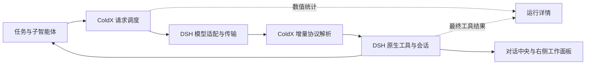

# ColdX 0.2.0：执行层、工作区与性能验证

日期：2026-09-19。协议比较基线为发布标签 `v0.1.4`；面板比较基线为该版本发布后的文档提交 `c58d63d`。

## 这次改了什么

ColdX 新增自己维护的请求调度、上下文计量和运行诊断，并重写流式协议解析热路径。DSH 继续提供模型适配、持久会话、权限、工具执行和插件生命周期；现有协议、数据目录与上游署名保留。这是执行控制层与工作区的改造，不是完整替换 DSH，也不是模型权重变化。



### 请求与生命周期

- 默认同时运行 4 个模型请求，最多等待 64 个；根任务优先，每连续放行最多 3 个根任务后允许一个等待的子任务，防止子任务长期得不到执行。队列内保持同类 FIFO。
- 排队取消不会调用提供方；流结束、异常、消费者退出均归还名额。不会由本层自动补发请求或注入提示词。
- 卸载执行层会取消实际原生 Agent 活动，包括正在执行的工具。保留原生状态观察器直到退出完成，防止“用户停止后立即追问”在卸载期间再次调用模型；排队的用户消息仍保留。
- 子任务先核验真实运行时父子归属，读取诊断时再核验原生目录和父会话身份。异步读取期间父会话失效时拒绝返回。

### 上下文与诊断

上下文计量不改动提供方请求：不重排提示词、不删除思考回放、不压缩工具结果、不重写图片。仅复用递归不可变的子树统计，遇到可变内容重新计量；遍历有工作量上限，超限显示“部分”。字符长度不是 token，也不是提供方缓存命中数。

诊断记录只保留数值与状态：请求计数、排队/首段/总时长、提供方实际返回的 usage、工具最终成功或失败。工具统计读取 `tools/result`，包括权限拒绝和后处理失败，不把工具本体返回当作最终成功。

运行记录有界：最多 256 个会话，每个保留最近 12 次请求；正在运行的会话不被淘汰。数据仅在当前后端进程内保留，重启或淘汰后的零计数不是历史总用量；历史消费仍查看“用量与活动”。不存消息、工具参数、路径、密钥或输出正文。全局并发数单独标注。

## 工作区

首页换成紧凑的任务入口。左侧任务列表、中央对话和输入框、右侧工作结果共用中性背景、轻分隔线和统一圆角，减少大型品牌图与卡片阴影的视觉占用。

保留加号菜单、文件上传与引用、Goal/Plan、模型推理滑块、Superpowers、终端、浏览器和电脑入口。桌面侧栏预留空间，窄屏转为可退出的抽屉；主题跟随原生设置。

“运行详情”只在展开时轮询；收起、切换任务与卸载会取消请求和定时器。收起后不展示可能过时的运行状态；Escape 关闭并返回焦点。对话流更新时，工作面板在单次投影中共享一次历史扫描，不跨渲染缓存可变对象。

## 本地性能实测

环境：Windows x64、Node 24.16.0、相同进程中的确定性输入。以下数值是 CPU 微基准，不包括模型推理、网络和完整任务执行，也不代表 token 费用下降或生成质量提升。

### 流式协议处理

每段 256 个 ASCII 字符，每个规模交替运行基线与新版 3 次，取中位数。包含围栏中的字面控制标记和末尾真实工具调用。生成的调用 UUID 归一化后，逐个输出块比较相等。

| 文本规模 | 增量段数 | 0.1.4 | 0.2.0 |
| --- | ---: | ---: | ---: |
| 16 KiB | 64 | 3.11 ms | 1.67 ms |
| 128 KiB | 512 | 142.94 ms | 4.40 ms |
| 1 MiB | 4096 | 13,012.79 ms | 34.83 ms |

旧实现对每个增量重新扫描已生成的完整文本。新版保留扫描游标、行首与围栏状态；最终权威文本仍单独检查一次。收益主要在长文本和大量小增量中，不能把最大规模的比例外推到普通短回复。

### 工作面板历史整理

固定 900 个对话节点、300 个工具调用、30 个页面、12 个子任务和 8 个后台任务。预热 20 次、测量 90 次；深比较投影输出相等。

| 指标 | 基线 | 新版 |
| --- | ---: | ---: |
| 中位数 | 1.1161 ms | 0.9503 ms |
| P90 | 1.6094 ms | 1.4896 ms |

这是 `selectActivityModel` 的单次耗时，不包含 React 绘制或页面整体帧率。小幅差异会受机器负载影响；确定性的改进是一次投影内不再重复读取同一对话树。

原始数值：[协议](performance/2026-09-19-protocol.json)、[面板](performance/2026-09-19-activity.json)。

复现（需要完整 Git 基线与已安装依赖）：

```sh
node scripts/bench-protocol.mjs --baseline-ref=v0.1.4 --iterations=3 --chunk-size=256
node scripts/bench-activity.mjs c58d63d
```

结果写到忽略提交的 `.runtime/bench-protocol.json` 与 `.runtime/bench-activity.json`。

## 验证范围

- 完整单元与集成套件 678 项：676 项通过、0 项失败、2 项条件性跳过（需要真实 Electron/原生窗口的交互检查）。
- 原生确定性模型测试覆盖并发上限、公平性、排队取消、流退出、失败、服务卸载、工具执行期间卸载、停止后追问保留、原生 aborted、最终工具结果和子任务归属。
- 协议测试覆盖跨增量分隔符、围栏字面内容、Unicode、长流、最终文本替换、工具调用和回放。测试不访问收费模型。
- 浏览器套件 41 项通过，包含原生输入框、模型控件、工作面板、PDF、键盘和响应式检查。
- 真实独立 ColdX Web 环境使用本地确定性模型，实际发送请求、读取诊断、打开右侧 Markdown 文件并引用回输入框；检查桌面、820px、390px、深浅模式、双模式标签与 Escape。此环境不使用安装版的配置或会话。
- 新工作区的独立视觉夹具只用于组件外观回归，不冒充安装版截图；桌面安装包的构建与烟测结果以对应 GitHub Actions 为准。

没有新增付费模型质量评测，因此不宣称比 Codex、Qoder、WorkBuddy 等产品更聪明。下一步模型质量实验应固定模型、任务、预算和环境，把成功率、重试、token 与费用一起比较。
