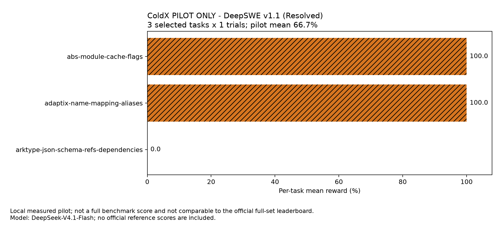

# ColdX × DeepSeek V4.1：研究与真实评测

日期：2026-09-13。执行与整理：**ChatGPT，受用户委托自动化执行**。

本轮固定三题中，2 题通过官方验证。结果只描述这三次运行，不是全量 benchmark 成绩。 本轮使用官方 API、固定原始任务和独立 verifier，实际运行的是 ColdX 原生 DSH，不是更换成另一个框架后再命名 ColdX。**DeepSWE 113 × 8 与 Terminal-Bench 89 × 3 的全量作业尚未执行；八个其他 agent 的数值来自官方报告，并未在这台机器重跑。**

## 三题实测

三题在看结果前按语言与任务 ID 顺序固定，每题一次；任务顺序、模型、工具、系统策略和 runtime 在本批次中未改变。没有挑选成功重跑。

| 任务 | 官方验证 | 总耗时 | 模型请求 | 观测用量估算 |
| --- | --- | --- | ---: | ---: |
| Go · `abs-module-cache-flags` | 通过 | 11 分 42 秒 | 175 | 约 ¥0.807 |
| Python · `adaptix-name-mapping-aliases` | 通过 | 16 分 22 秒 | 174 | 约 ¥1.192 |
| TypeScript · `arktype-json-schema-refs-dependencies` | 未通过 | 29 分 37 秒 | 184 | 约 ¥1.354 |

图中每题只有一次尝试。不能把该图的比例当作泛化性能，或与官方数百次样本的均值直接比较。

### 第三题为什么失败

原有回归 1679/1679、新增验收 23/25 通过；两项失败来自递归引用与 `anyOf` 联合分支组合时的提前求值。任务已明确提醒这一边界。ColdX 做了真实自测，但自建测试没有覆盖这个组合，最终完成声明超出了实际验证范围。优先改进风险组合验收和基于证据的收尾，而非将失败归咎于环境。[完整失败复盘](benchmarks/2026-09-13/failure-review.md)

## token 和费用

本轮三题已报告用量的价目估算合计约 ¥3.353。HTTP 收尾与 usage 覆盖分别记录；部分连接被客户端取消，计量完整性仍保持保守标记。它不是供应商最终账单。 价格按本轮周日官方谷时价计算；缓存输入 / 未缓存输入 / 输出每百万 token 分别为 ¥0.02 / ¥1 / ¥4。[官方定价](https://api-docs.deepseek.com/zh-cn/quick_start/pricing/)

| 任务 | 累计输入 | 其中缓存输入 | 输出（包含思考） | 输入缓存占比 | 未完整响应 |
| --- | ---: | ---: | ---: | ---: | ---: |
| Go | 18,780,265 | 18,674,688 | 81,884 | 99.44% | 1 |
| Python | 27,030,810 | 26,902,784 | 131,479 | 99.53% | 3 |
| TypeScript | 31,317,124 | 31,180,800 | 148,571 | 99.56% | 1 |

用量来自任务外的最终转发层，包含辅助模型请求与原生重试；两层代理不重复相加，reasoning 不再重复加入输出。Pier 的输入 token 摘要没有涵盖大量缓存输入，本报告因此不把它当作总输入。即使请求带有 usage，也不等于响应完整结束，保留这两个维度。

只读检查锁定的 DSH 依赖和计数后，一个受证据支持的解释是 SSE 已收到 `[DONE]` 并输出 usage/finish，随后清理 consumer 时取消了尚未自然收尾的 HTTP 连接。转发器要求逻辑结束与 HTTP pipeline 都完成，因而可能留下 `incomplete`。这不是逐请求证明，仍保留保守标记；没有为了改善报表而修改这批运行代码或分数。

此前应用户要求中断的一次运行单独归档，不进入成绩；其已报告分项估算约 ¥0.497，完整费用未知。

若 904 次都重复本轮三题的已报告平均用量，DeepSWE 谷时情景约 ¥1,010，按代理平均生命周期串行约 290 小时。这是条件算术，不是可靠预算预测。本轮未启动这笔全量作业；Terminal-Bench 尚无实测成本。 没有把未运行题目补成零，也没有将这些情景写成全量成绩。

## 怎样提高质量，再节省费用

先做协议与完成语义检查，保证真实路由、thinking 回放、工具调用、截断与错误处理正确；再用真实环境反馈控制返工。页面任务应经历实际运行、截图/DOM 检查、交互操作、修复与重验，显示 iframe 本身不等于完成。

工具保持清晰职责与稳定顺序；子智能体承担能独立验收的任务，保留负责范围、成果、失败和父任务归属。上下文治理优先减少工具结果首次进入上下文时的无关内容，完整证据留在可恢复文件里。长期记忆从带来源、时间和适用范围的记录起步，再通过评测决定是否增加向量或图检索。

不要仅以缓存百分比或输入变短判定优化成功。在当前价目中，一个输出 token 相当于 200 个缓存输入 token；无效生成和返工值得优先控制。high/max、压缩策略、工具数量、记忆和子智能体都应做受控消融，而非同时变化后归因于某一个因素。**本轮没有运行这些候选方案的质量 A/B，因此不宣称提升幅度。**

## 完整研究材料

- [V4.1 生成质量、任务成本与社区方法研究](deepseek-v41-performance-token-efficiency-2026-09-12.md)：参数语义、缓存价格、压缩回本、工具设计、民间方法证据分级及来源。
- [实验矩阵](deepseek-v41-experiments-2026-09-12.json)：候选消融与验收门；不是已执行的模型成绩。
- [生成质量底层研究](../deepseek-quality-foundations.md)：模型架构、环境反馈、工具集合、上下文治理、长期记忆与页面生成闭环。
- [DeepSeek agent harness 研究](../deepseek-agent-harness-research.md)：原生接入与协议约束。
- [Computer Use 研究](deepseek-computer-use-2026-09-12.md)：视觉和浏览器执行的能力边界。
- [工作台竞品审查](../workbench-review-2026-09-12.md)：文件与产物预览、执行轨迹、验收和任务工作流。
- [本次环境、协议和复现限制](benchmarks/2026-09-13/protocol.md)。历史文档均标注研究取样时点，不应将历史路由视为本批次配置。

## 代码与数据

- [原生评测工具与部署说明](../../eval/benchmark/README.md)
- [精确冻结源码恢复](../../eval/benchmark/frozen-baseline/README.md)
- [每题结果、用量覆盖与来源哈希](benchmarks/2026-09-13/results.json)
- [官方八框架参考图](benchmarks/2026-09-13/official-reference.png)，源自 [固定版本官方模型卡](https://huggingface.co/deepseek-ai/DeepSeek-V4.1-Flash/blob/dba1be0a40aa45a94ad051997016db3960a90277/README.md)；不是 ColdX 实测。
- [老师阅读用 PDF 摘要](benchmarks/2026-09-13/ColdX-DeepSeek-research-summary.pdf)

公开材料排除 API key、逐 key 账单、原始会话、工具日志和私人配置。原始 trial 在本地保留，合并时逐字节复制并记录 SHA-256；公开 JSON 使用字段白名单，仅发布可核验的结果与来源。
